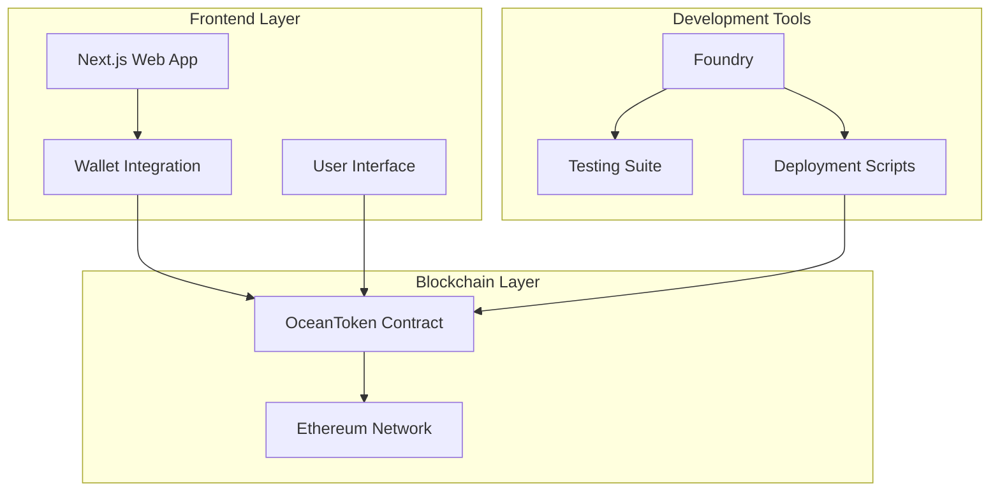
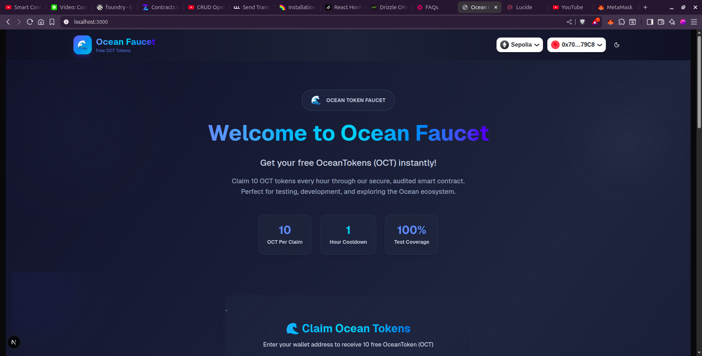
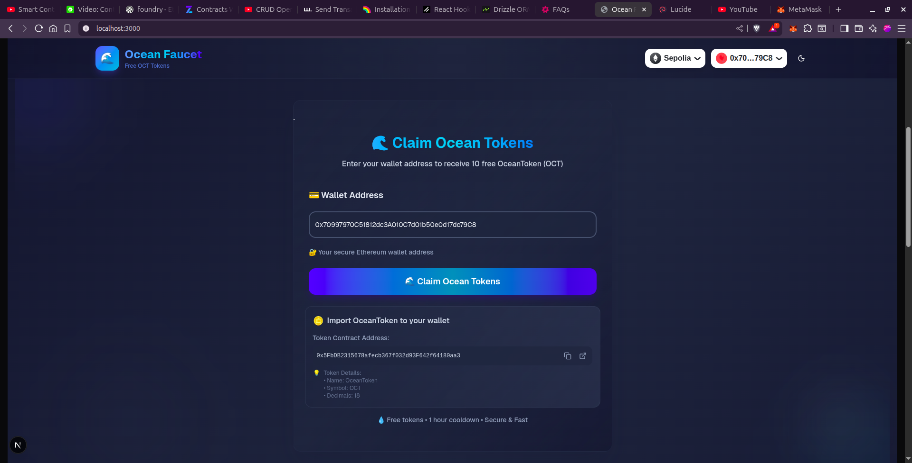
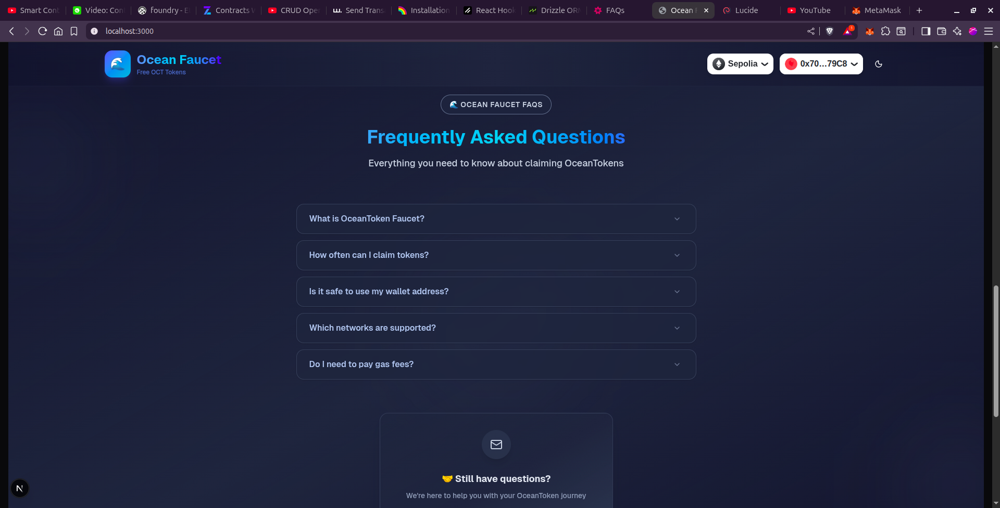
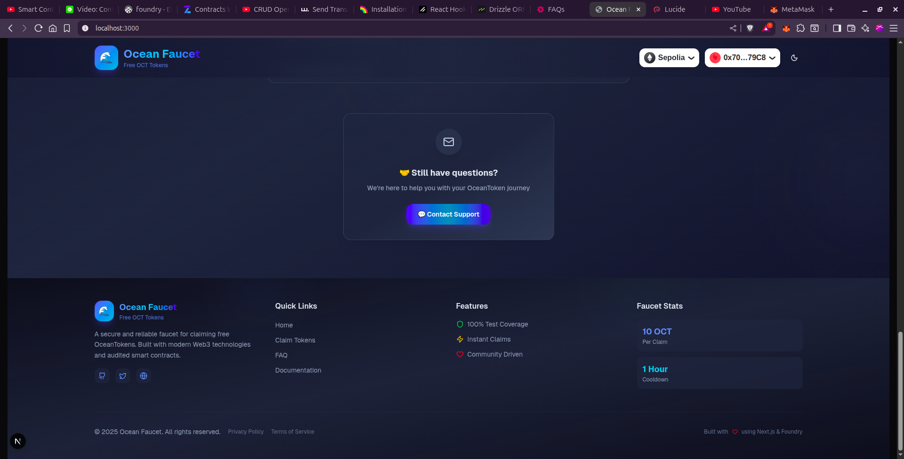
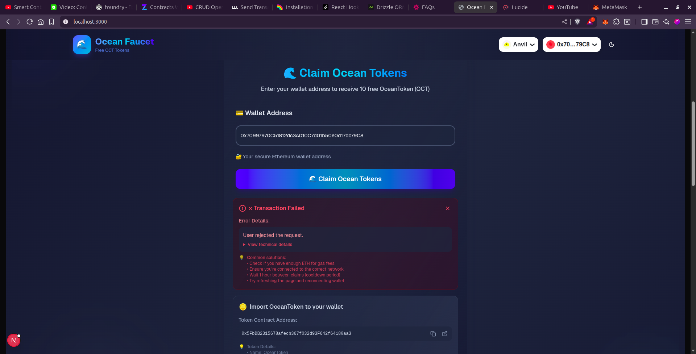
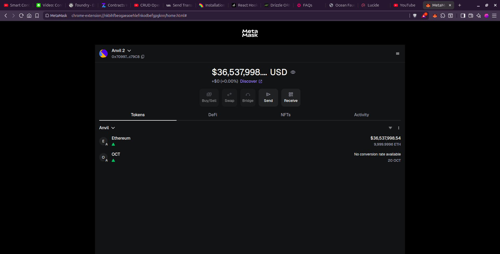

# 🌊 OceanToken Faucet - Full Stack DApp

> **A complete decentralized application for distributing OceanToken (OCT) with a secure smart contract backend and modern web frontend**

[](https://opensource.org/licenses/MIT)
[](https://soliditylang.org/)
[](https://getfoundry.sh/)
[](./ocean-faucet-contract/test)
[](./frontend)

## 📋 Table of Contents

- [🌊 OceanToken Faucet - Full Stack DApp](#-oceantoken-faucet---full-stack-dapp)
  - [📋 Table of Contents](#-table-of-contents)
  - [📖 Overview](#-overview)
    - [🎯 What it does](#-what-it-does)
  - [🏗️ Project Structure](#️-project-structure)
  - [✨ Features](#-features)
    - [🔗 Smart Contract Features](#-smart-contract-features)
    - [🌐 Frontend Features](#-frontend-features)
  - [🎯 Architecture](#-architecture)
  - [📚 **Detailed Documentation**](#-detailed-documentation)
    - [🔗 **Smart Contract Backend**](#-smart-contract-backend)
    - [🌐 **Frontend Application**](#-frontend-application)
  - [🚀 Getting Started](#-getting-started)
    - [📦 Prerequisites](#-prerequisites)
    - [⚙️ Quick Start](#️-quick-start)
  - [🔧 Development](#-development)
    - [🏗️ Smart Contract Development](#️-smart-contract-development)
    - [🌐 Frontend Development](#-frontend-development)
  - [📊 Project Status](#-project-status)
    - [✅ Completed Components](#-completed-components)
    - [🔄 In Progress Components](#-in-progress-components)
  - [🧪 Testing](#-testing)
    - [Smart Contract Testing](#smart-contract-testing)
  - [🌆 Screenshots](#-screenshots)
  - [🚀 Deployment](#-deployment)
    - [Smart Contract Deployment](#smart-contract-deployment)
    - [Frontend Deployment](#frontend-deployment)
  - [🔒 Security](#-security)
    - [Smart Contract Security](#smart-contract-security)
    - [Frontend Security](#frontend-security)
    - [Development Guidelines](#development-guidelines)
  - [🧒 Author](#-author)
  - [📜 License](#-license)

## 📖 Overview

**OceanToken Faucet** is a full-stack decentralized application that allows users to easily claim OceanToken (OCT) through a user-friendly web interface. The project consists of a secure Solidity smart contract backend built with Foundry and a modern frontend application.

> 📚 **For detailed documentation, please visit:**
>
> 🔗 **[Smart Contract Documentation](./ocean-faucet-contract/README.md)** - Comprehensive contract details, testing, and deployment
>
> 🌐 **[Frontend Documentation](./ocean-faucet-ui/README.md)** - Complete UI setup, Web3 integration, and development guide

### 🎯 What it does

- **Token Distribution**: Users can claim 10 OCT tokens every hour
- **Rate Limiting**: Built-in cooldown mechanism prevents spam
- **Secure Backend**: 100% test coverage with comprehensive security measures
- **User-Friendly Interface**: Modern web UI for easy token claiming

## 🏗️ Project Structure

```md
ocean-faucet/
├── 📁 ocean-faucet-contract/     # Smart Contract Backend
│   ├── 📁 src/                   # Contract source code
│   │   └── OceanToken.sol        # Main faucet contract
│   ├── 📁 test/                  # Comprehensive test suite
│   │   ├── 📁 unit/              # Unit tests (100% coverage)
│   │   └── 📁 fuzz/              # Fuzz tests (6 tests)
│   ├── 📁 script/                # Deployment scripts
│   ├── foundry.toml              # Foundry configuration
│   └── README.md                 # Contract documentation
├── 📁 ocean-faucet-ui/           # Frontend Application
│   ├── 📁 src/                   # Source code
│   │   ├── 📁 app/               # Next.js app directory
│   │   ├── 📁 components/        # React components
│   │   ├── 📁 providers/         # Context providers
│   │   └── 📁 lib/               # Utility functions
│   ├── package.json              # Dependencies
│   └── README.md                 # Frontend documentation
├── LICENSE                       # MIT License
└── README.md                     # This file
```

## ✨ Features

### 🔗 Smart Contract Features

- ✅ **ERC20 Compliant**: Full standard implementation
- ✅ **Rate Limited Faucet**: 1-hour cooldown between claims
- ✅ **Access Control**: Owner-only administrative functions
- ✅ **Security Hardened**: Input validation and error handling
- ✅ **Event Logging**: Comprehensive transaction tracking
- ✅ **100% Test Coverage**: Unit and fuzz testing
- ✅ **Deployed on Anvil**: Contract deployed at `0x5FbDB2315678afecb367f032d93f642f64180aa3`

### 🌐 Frontend Features

- ✅ **Next.js with TypeScript**: Modern React framework setup
- ✅ **Wallet Integration**: RainbowKit + wagmi implementation
- ✅ **Ocean-Themed UI**: Stunning ocean-inspired design with animations
- ✅ **Multi-Chain Support**: Mainnet, testnets, and local Anvil networks
- ✅ **Theme System**: Dark/light mode with optimized ocean themes
- ✅ **UI Components**: Shadcn/ui component library with custom styling
- ✅ **Faucet Interface**: Fully functional token claiming UI
- ✅ **Transaction Handling**: Complete success/error state management
- ✅ **Real-time Updates**: Live transaction status and user feedback

## 🎯 Architecture



---

## 📚 **Detailed Documentation**

<table>
<tr>
<td align="center" width="50%">

### 🔗 **Smart Contract Backend**

[](./ocean-faucet-contract/README.md)

**Complete contract documentation including:**

- 📋 Contract specifications and API
- 🧪 Testing strategies (100% coverage)
- 🚀 Deployment instructions
- 🔒 Security implementations
- 🎯 Fuzz testing details

</td>
<td align="center" width="50%">

### 🌐 **Frontend Application**

[](./ocean-faucet-ui/README.md)

**Complete frontend documentation including:**

- ⚙️ Setup and installation guide
- 🛠️ Development environment
- 🔗 Web3 integration details
- 🎨 UI components and theming
- 🚀 Deployment strategies

</td>
</tr>
</table>

---

## 🚀 Getting Started

### 📦 Prerequisites

- [Bun](https://bun.sh/) - Fast JavaScript runtime and package manager
- [Foundry](https://getfoundry.sh/) - Ethereum development toolkit
- [Git](https://git-scm.com/) - Version control
- [MetaMask](https://metamask.io/) - For frontend testing

### ⚙️ Quick Start

1. **Clone the repository**

   ```bash
   git clone https://github.com/kavinda-100/ocean-faucet.git
   cd ocean-faucet
   ```

2. **Set up the smart contract**

   ```bash
   cd ocean-faucet-contract
   forge install
   forge build
   forge test
   ```

3. **Set up the frontend**

   ```bash
   cd ocean-faucet-ui
   bun install
   bun run dev
   ```

## 🔧 Development

### 🏗️ Smart Contract Development

The smart contract is fully developed and production-ready:

```bash
cd ocean-faucet-contract

# Install dependencies
forge install

# Build contracts
forge build

# Run tests
forge test

# Check coverage
forge coverage

# Run fuzz tests
forge test --match-path "**/fuzz/**" -vv

# Deploy locally
forge script script/OceanTokenDeployer.s.sol --rpc-url http://localhost:8545 --private-key <your_private_key> --broadcast
```

**Contract Details:**

- **Address**: `0x5FbDB2315678afecb367f032d93f642f64180aa3` (Anvil Local)
- **Name**: OceanToken (OCT)
- **Initial Supply**: 1,000,000 OCT
- **Claim Amount**: 10 OCT per request
- **Claim Interval**: 1 hour

### 🌐 Frontend Development

The frontend is fully developed and integrated with the deployed contract:

**Tech Stack:**

- **Framework**: Next.js 15 with TypeScript
- **Runtime**: Bun.js
- **Styling**: Tailwind CSS
- **Web3**: wagmi + RainbowKit
- **Theme**: next-themes with dark/light mode
- **State Management**: TanStack Query

**Development Commands:**

```bash
cd ocean-faucet-ui

# Install dependencies
bun install

# Start development server
bun run dev

# Build for production
bun run build

# Run linting
bun run lint

# Type checking
bun run typecheck
```

## 📊 Project Status

### ✅ Completed Components

| Component | Status | Coverage | Description |
|-----------|---------|----------|-------------|
| **Smart Contract** | ✅ Complete | 100% | Fully tested and deployed on Anvil |
| **Unit Tests** | ✅ Complete | 100% | 10 comprehensive tests |
| **Fuzz Tests** | ✅ Complete | 100% | 6 property-based tests |
| **Deployment Scripts** | ✅ Complete | 100% | Automated deployment with Makefile |
| **State Management** | ✅ Complete | N/A | Anvil state persistence with `state.json` |
| **Documentation** | ✅ Complete | N/A | Comprehensive docs |
| **Frontend Setup** | ✅ Complete | N/A | Next.js + TypeScript + Bun |
| **Web3 Integration** | ✅ Complete | N/A | wagmi + RainbowKit |
| **UI Foundation** | ✅ Complete | N/A | Ocean-themed Shadcn/ui + Tailwind CSS |
| **Theme System** | ✅ Complete | N/A | Dark/light mode with ocean themes |
| **Faucet Interface** | ✅ Complete | N/A | Fully functional token claiming |
| **Contract Integration** | ✅ Complete | N/A | Connected to deployed Anvil contract |
| **Transaction Handling** | ✅ Complete | N/A | Success/error state management |

### 🔄 In Progress Components

All core components are complete! The project is ready for production use.

## 🧪 Testing

### Smart Contract Testing

Our smart contract has comprehensive test coverage:

| Metric | Coverage |
|--------|----------|
| **Lines** | ✅ 100% (27/27) |
| **Statements** | ✅ 100% (24/24) |
| **Branches** | ✅ 100% (2/2) |
| **Functions** | ✅ 100% (7/7) |

**Test Categories:**

- **Unit Tests**: 10 tests covering all functionality
- **Fuzz Tests**: 6 tests with 256 runs each
- **Integration Tests**: Full contract interaction scenarios
- **Security Tests**: Access control and edge cases

## 🌆 Screenshots

Take a visual tour of the OceanToken Faucet DApp and see its beautiful ocean-themed interface in action.

<div align="center">
  
  <p><em>🌊 Beautiful ocean-themed homepage with wallet connection</em></p>
</div>

<div align="center">
  
  <p><em>💰 Intuitive token claiming interface with real-time feedback</em></p>
</div>

<div align="center">
  
  <p><em>🔗 Frequently Asked Questions</em></p>
</div>

<div align="center">
  
  <p><em>⚙️ Frequently Asked Questions Con. and Footer</em></p>
</div>

<div align="center">
  
  <p><em>✅ Successful transaction with real-time feedback and status updates</em></p>
</div>

<div align="center">
  
  <p><em>🔦 Error message when claiming tokens if transaction fails</em></p>
</div>

<div align="center">
  
  <p><em>🌊 OCT Token after claiming in the user wallet</em></p>
</div>

## 🚀 Deployment

### Smart Contract Deployment

The contract is successfully deployed on local Anvil chain:

```bash
# Start Anvil with state persistence
cd ocean-faucet-contract
make persist-state-load

# Deploy to Anvil (if not already deployed)
make deploy-local-verify

# Contract Address: 0x5FbDB2315678afecb367f032d93f642f64180aa3
```

**State Management:**

- **State File**: `state.json` tracks the complete blockchain state
- **Persistence**: Anvil can be restarted with previous state intact
- **Makefile Commands**: Automated state management and deployment

```bash
# Useful Makefile commands
make persist-state-load    # Load Anvil with previous state
make persist-state-dump    # Start Anvil with state saving
make persist-state-clean   # Clean state file
make persist-state-info    # Show state file information
make deploy-local          # Deploy contract to Anvil
make show-anvil-accounts   # Show test accounts
```

**Deployment Networks:**

```bash
# Local deployment (Anvil) - Currently deployed
make deploy-local-verify

# Testnet deployment (Sepolia)
make deploy-sepolia

# Mainnet deployment
forge script script/OceanTokenDeployer.s.sol --rpc-url <mainnet_rpc_url> --private-key <your_private_key> --broadcast --verify
```

### Frontend Deployment

The frontend is fully developed and ready for deployment:

```bash
cd ocean-faucet-ui

# Development
bun run dev

# Production build
bun run build
bun run start

# Deploy to Vercel (recommended)
vercel deploy
```

**Frontend Features:**

- ✅ Connected to deployed Anvil contract
- ✅ Ocean-themed UI with dark/light modes
- ✅ Complete transaction handling
- ✅ Real-time status updates
- ✅ Error handling and user feedback

## 🔒 Security

### Smart Contract Security

- ✅ **Access Control**: Owner-only minting capabilities
- ✅ **Rate Limiting**: Prevents spam and abuse
- ✅ **Input Validation**: Zero address and parameter checks
- ✅ **Overflow Protection**: Built-in SafeMath (Solidity ^0.8.0)
- ✅ **Event Logging**: Complete audit trail
- ✅ **Fuzz Testing**: Edge case validation

### Frontend Security

- ✅ **Wallet Security**: Secure wallet connection with RainbowKit
- ✅ **Type Safety**: Full TypeScript implementation
- ✅ **Environment Variables**: Secure configuration management
- 🔄 **Input Sanitization**: XSS and injection prevention (planned)
- 🔄 **HTTPS Only**: Secure communication (planned)

### Development Guidelines

- **Smart Contract**: Follow Solidity best practices and maintain 100% test coverage
- **Frontend**: Follow Next.js and TypeScript best practices with Bun.js runtime
- **Documentation**: Update relevant documentation for any changes
- **Testing**: Add tests for new features

## 🧒 Author

- **Kavinda Rathnayake** - *Full Stack Web3 Developer*
  - GitHub: [@kavinda-100](https://github.com/kavinda-100)
  - Project: [OceanToken Faucet](https://github.com/kavinda-100/ocean-faucet)

## 📜 License

This project is licensed under the MIT License - see the [LICENSE](LICENSE) file for details.

---

Built with ❤️ using **Foundry & Next.js + TypeScript + Bun**

[⭐ Star this repo](https://github.com/kavinda-100/ocean-faucet)
