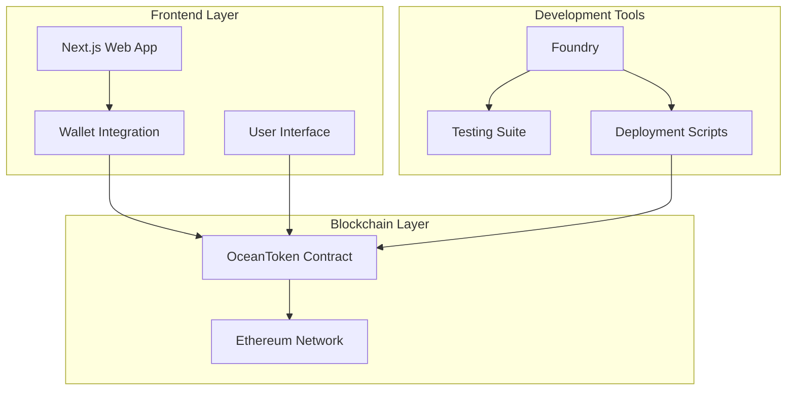

# 🌊 OceanToken Faucet - Full Stack DApp

> **A complete decentralized application for distributing OceanToken (OCT) with a secure smart contract backend and modern web frontend**

[](https://opensource.org/licenses/MIT)
[](https://soliditylang.org/)
[](https://getfoundry.sh/)
[](./ocean-faucet-contract/test)
[](./frontend)

## 📋 Table of Contents

- [🌊 OceanToken Faucet - Full Stack DApp](#-oceantoken-faucet---full-stack-dapp)
  - [📋 Table of Contents](#-table-of-contents)
  - [📖 Overview](#-overview)
    - [🎯 What it does](#-what-it-does)
  - [🏗️ Project Structure](#️-project-structure)
  - [✨ Features](#-features)
    - [🔗 Smart Contract Features](#-smart-contract-features)
    - [🌐 Frontend Features](#-frontend-features)
  - [🎯 Architecture](#-architecture)
  - [🚀 Getting Started](#-getting-started)
    - [📦 Prerequisites](#-prerequisites)
    - [⚙️ Quick Start](#️-quick-start)
  - [🔧 Development](#-development)
    - [🏗️ Smart Contract Development](#️-smart-contract-development)
    - [🌐 Frontend Development](#-frontend-development)
  - [📊 Project Status](#-project-status)
    - [✅ Completed Components](#-completed-components)
    - [🔄 In Progress Components](#-in-progress-components)
  - [🧪 Testing](#-testing)
    - [Smart Contract Testing](#smart-contract-testing)
  - [🚀 Deployment](#-deployment)
    - [Smart Contract Deployment](#smart-contract-deployment)
    - [Frontend Deployment](#frontend-deployment)
  - [🔒 Security](#-security)
    - [Smart Contract Security](#smart-contract-security)
    - [Frontend Security](#frontend-security)
    - [Development Guidelines](#development-guidelines)
  - [🧒 Author](#-author)
  - [📜 License](#-license)

## 📖 Overview

**OceanToken Faucet** is a full-stack decentralized application that allows users to easily claim OceanToken (OCT) through a user-friendly web interface. The project consists of a secure Solidity smart contract backend built with Foundry and a modern frontend application.

### 🎯 What it does

- **Token Distribution**: Users can claim 10 OCT tokens every hour
- **Rate Limiting**: Built-in cooldown mechanism prevents spam
- **Secure Backend**: 100% test coverage with comprehensive security measures
- **User-Friendly Interface**: Modern web UI for easy token claiming

## 🏗️ Project Structure

```md
ocean-faucet/
├── 📁 ocean-faucet-contract/     # Smart Contract Backend
│   ├── 📁 src/                   # Contract source code
│   │   └── OceanToken.sol        # Main faucet contract
│   ├── 📁 test/                  # Comprehensive test suite
│   │   ├── 📁 unit/              # Unit tests (100% coverage)
│   │   └── 📁 fuzz/              # Fuzz tests (6 tests)
│   ├── 📁 script/                # Deployment scripts
│   ├── foundry.toml              # Foundry configuration
│   └── README.md                 # Contract documentation
├── 📁 ocean-faucet-ui/           # Frontend Application
│   ├── 📁 src/                   # Source code
│   │   ├── 📁 app/               # Next.js app directory
│   │   ├── 📁 components/        # React components
│   │   ├── 📁 providers/         # Context providers
│   │   └── 📁 lib/               # Utility functions
│   ├── package.json              # Dependencies
│   └── README.md                 # Frontend documentation
├── LICENSE                       # MIT License
└── README.md                     # This file
```

## ✨ Features

### 🔗 Smart Contract Features

- ✅ **ERC20 Compliant**: Full standard implementation
- ✅ **Rate Limited Faucet**: 1-hour cooldown between claims
- ✅ **Access Control**: Owner-only administrative functions
- ✅ **Security Hardened**: Input validation and error handling
- ✅ **Event Logging**: Comprehensive transaction tracking
- ✅ **100% Test Coverage**: Unit and fuzz testing

### 🌐 Frontend Features

- ✅ **Next.js with TypeScript**: Modern React framework setup
- ✅ **Wallet Integration**: RainbowKit + wagmi implementation
- ✅ **Multi-Chain Support**: Mainnet, testnets, and local networks
- ✅ **Theme System**: Dark/light mode with next-themes
- ✅ **UI Components**: Shadcn/ui component library
- ✅ **Responsive Header**: With wallet connection and theme toggle
- 🔄 **Faucet Interface**: Token claiming UI (in progress)
- 🔄 **Transaction History**: User claim tracking (planned)
- 🔄 **Real-time Updates**: Live claim status and cooldown timers (planned)

## 🎯 Architecture



## 🚀 Getting Started

### 📦 Prerequisites

- [Bun](https://bun.sh/) - Fast JavaScript runtime and package manager
- [Foundry](https://getfoundry.sh/) - Ethereum development toolkit
- [Git](https://git-scm.com/) - Version control
- [MetaMask](https://metamask.io/) - For frontend testing

### ⚙️ Quick Start

1. **Clone the repository**

   ```bash
   git clone https://github.com/kavinda-100/ocean-faucet.git
   cd ocean-faucet
   ```

2. **Set up the smart contract**

   ```bash
   cd ocean-faucet-contract
   forge install
   forge build
   forge test
   ```

3. **Set up the frontend**

   ```bash
   cd ocean-faucet-ui
   bun install
   bun run dev
   ```

## 🔧 Development

### 🏗️ Smart Contract Development

The smart contract is fully developed and production-ready:

```bash
cd ocean-faucet-contract

# Install dependencies
forge install

# Build contracts
forge build

# Run tests
forge test

# Check coverage
forge coverage

# Run fuzz tests
forge test --match-path "**/fuzz/**" -vv

# Deploy locally
forge script script/OceanTokenDeployer.s.sol --rpc-url http://localhost:8545 --private-key <your_private_key> --broadcast
```

**Contract Details:**

- **Address**: TBD (after deployment)
- **Name**: OceanToken (OCT)
- **Initial Supply**: 1,000,000 OCT
- **Claim Amount**: 10 OCT per request
- **Claim Interval**: 1 hour

### 🌐 Frontend Development

The frontend is built with modern web technologies and Web3 integration:

**Tech Stack:**

- **Framework**: Next.js 15 with TypeScript
- **Runtime**: Bun.js
- **Styling**: Tailwind CSS
- **Web3**: wagmi + RainbowKit
- **Theme**: next-themes with dark/light mode
- **State Management**: TanStack Query

**Development Commands:**

```bash
cd ocean-faucet-ui

# Install dependencies
bun install

# Start development server
bun run dev

# Build for production
bun run build

# Run linting
bun run lint

# Type checking
bun run typecheck
```

## 📊 Project Status

### ✅ Completed Components

| Component | Status | Coverage | Description |
|-----------|---------|----------|-------------|
| **Smart Contract** | ✅ Complete | 100% | Fully tested and audited |
| **Unit Tests** | ✅ Complete | 100% | 10 comprehensive tests |
| **Fuzz Tests** | ✅ Complete | 100% | 6 property-based tests |
| **Deployment Scripts** | ✅ Complete | 100% | Automated deployment |
| **Documentation** | ✅ Complete | N/A | Comprehensive docs |
| **Frontend Setup** | ✅ Complete | N/A | Next.js + TypeScript + Bun |
| **Web3 Integration** | ✅ Complete | N/A | wagmi + RainbowKit |
| **UI Foundation** | ✅ Complete | N/A | Shadcn/ui + Tailwind CSS |
| **Theme System** | ✅ Complete | N/A | Dark/light mode toggle |

### 🔄 In Progress Components

| Component | Status | Progress | ETA |
|-----------|---------|----------|-----|
| **Faucet Interface** | 🔄 In Progress | 20% | TBD |
| **Contract Integration** | 🔄 Planning | 0% | TBD |
| **Transaction Handling** | 🔄 Planning | 0% | TBD |
| **Error Handling** | 🔄 Planning | 0% | TBD |

## 🧪 Testing

### Smart Contract Testing

Our smart contract has comprehensive test coverage:

| Metric | Coverage |
|--------|----------|
| **Lines** | ✅ 100% (27/27) |
| **Statements** | ✅ 100% (24/24) |
| **Branches** | ✅ 100% (2/2) |
| **Functions** | ✅ 100% (7/7) |

**Test Categories:**

- **Unit Tests**: 10 tests covering all functionality
- **Fuzz Tests**: 6 tests with 256 runs each
- **Integration Tests**: Full contract interaction scenarios
- **Security Tests**: Access control and edge cases

## 🚀 Deployment

### Smart Contract Deployment

The contract can be deployed to various networks:

```bash
# Local deployment (Anvil)
forge script script/OceanTokenDeployer.s.sol --rpc-url http://localhost:8545 --private-key <your_private_key> --broadcast

# Testnet deployment (Sepolia)
forge script script/OceanTokenDeployer.s.sol --rpc-url <sepolia_rpc_url> --private-key <your_private_key> --broadcast --verify

# Mainnet deployment
forge script script/OceanTokenDeployer.s.sol --rpc-url <mainnet_rpc_url> --private-key <your_private_key> --broadcast --verify
```

### Frontend Deployment

- **Development**: `bun run dev` - Local development server
- **Production**: Vercel deployment ready

## 🔒 Security

### Smart Contract Security

- ✅ **Access Control**: Owner-only minting capabilities
- ✅ **Rate Limiting**: Prevents spam and abuse
- ✅ **Input Validation**: Zero address and parameter checks
- ✅ **Overflow Protection**: Built-in SafeMath (Solidity ^0.8.0)
- ✅ **Event Logging**: Complete audit trail
- ✅ **Fuzz Testing**: Edge case validation

### Frontend Security

- ✅ **Wallet Security**: Secure wallet connection with RainbowKit
- ✅ **Type Safety**: Full TypeScript implementation
- ✅ **Environment Variables**: Secure configuration management
- 🔄 **Input Sanitization**: XSS and injection prevention (planned)
- 🔄 **HTTPS Only**: Secure communication (planned)

### Development Guidelines

- **Smart Contract**: Follow Solidity best practices and maintain 100% test coverage
- **Frontend**: Follow Next.js and TypeScript best practices with Bun.js runtime
- **Documentation**: Update relevant documentation for any changes
- **Testing**: Add tests for new features

## 🧒 Author

- **Kavinda Rathnayake** - *Full Stack Web3 Developer*
  - GitHub: [@kavinda-100](https://github.com/kavinda-100)
  - Project: [OceanToken Faucet](https://github.com/kavinda-100/ocean-faucet)

## 📜 License

This project is licensed under the MIT License - see the [LICENSE](LICENSE) file for details.

---

Built with ❤️ using **Foundry & Next.js + TypeScript + Bun**

[⭐ Star this repo](https://github.com/kavinda-100/ocean-faucet)
