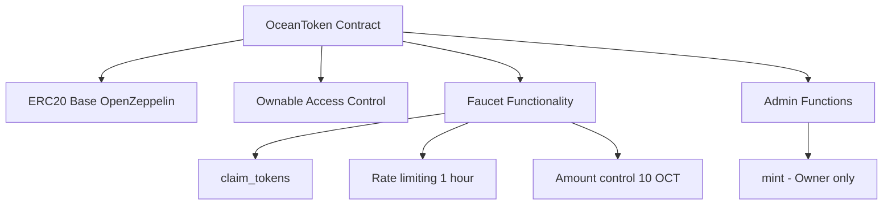

# 🌊 OceanToken Faucet

> **A robust and secure ERC20 token faucet built with Foundry**

[](https://opensource.org/licenses/MIT)
[](https://soliditylang.org/)
[](https://getfoundry.sh/)
[](./test)

## 📋 Table of Contents

- [🌊 OceanToken Faucet](#-oceantoken-faucet)
  - [📋 Table of Contents](#-table-of-contents)
  - [📖 Overview](#-overview)
  - [✨ Features](#-features)
  - [🏗️ Architecture](#️-architecture)
  - [🧪 Test Coverage](#-test-coverage)
    - [🎯 Test Categories](#-test-categories)
  - [🚀 Getting Started](#-getting-started)
    - [📦 Prerequisites](#-prerequisites)
    - [⚙️ Installation](#️-installation)
  - [🔧 Usage](#-usage)
    - [🏗️ Build](#️-build)
    - [🧪 Test](#-test)
    - [📊 Coverage](#-coverage)
    - [🎯 Fuzz Testing](#-fuzz-testing)
    - [💅 Format](#-format)
    - [📈 Gas Snapshots](#-gas-snapshots)
    - [🚀 Deploy](#-deploy)
  - [📄 Contract Details](#-contract-details)
    - [OceanToken Contract](#oceantoken-contract)
    - [Key Functions](#key-functions)
  - [🔒 Security](#-security)
  - [🧒 Author](#-author)
  - [📜 License](#-license)

## 📖 Overview

**OceanToken (OCT)** is a secure ERC20 token faucet that allows users to claim tokens with built-in rate limiting. The contract implements a time-based claiming mechanism where users can claim 10 OCT tokens every hour, making it perfect for testnet environments or token distribution scenarios.

## ✨ Features

- 🪙 **ERC20 Compliant**: Full ERC20 standard implementation
- ⏰ **Rate Limited**: 1-hour cooldown between claims
- 🔒 **Access Control**: Owner-only minting capabilities
- 💧 **Faucet Mechanism**: Easy token claiming for users
- 🛡️ **Security**: Input validation and error handling
- 📊 **Events**: Comprehensive event logging
- ✅ **Fully Tested**: 100% test coverage with fuzz testing

## 🏗️ Architecture



## 🧪 Test Coverage

Our comprehensive test suite ensures reliability and security:

| Component | Lines | Statements | Branches | Functions |
|-----------|-------|------------|----------|-----------|
| **OceanToken.sol** | ✅ 100% (17/17) | ✅ 100% (14/14) | ✅ 100% (2/2) | ✅ 100% (6/6) |
| **Deployer Script** | ✅ 100% (10/10) | ✅ 100% (10/10) | ✅ 100% (0/0) | ✅ 100% (1/1) |
| **Total Coverage** | ✅ **100%** (27/27) | ✅ **100%** (24/24) | ✅ **100%** (2/2) | ✅ **100%** (7/7) |

### 🎯 Test Categories

- **Unit Tests**: 10 comprehensive tests covering all functionality
- **Fuzz Tests**: 6 property-based tests with 256 runs each
- **Integration Tests**: Full contract interaction scenarios
- **Security Tests**: Access control and edge case validation

## 🚀 Getting Started

### 📦 Prerequisites

- [Foundry](https://getfoundry.sh/) - Ethereum development toolkit
- [Git](https://git-scm.com/) - Version control

### ⚙️ Installation

1. **Clone the repository**

   ```bash
   git clone https://github.com/kavinda-100/ocean-faucet.git
   cd ocean-faucet/ocean-faucet-contract
   ```

2. **Install dependencies**

   ```bash
   forge install
   ```

3. **Build the project**

   ```bash
   forge build
   ```

## 🔧 Usage

### 🏗️ Build

Compile the smart contracts:

```bash
forge build
```

### 🧪 Test

Run the complete test suite:

```bash
# Run all tests
forge test

# Run with verbosity
forge test -vvv

# Run specific test file
forge test --match-path "test/unit/OceanToken.t.sol"
```

### 📊 Coverage

Generate test coverage reports:

```bash
# Basic coverage
forge coverage

# Detailed coverage report
forge coverage --report debug
```

### 🎯 Fuzz Testing

Run fuzz tests to ensure robustness:

```bash
# Run fuzz tests
forge test --match-path "**/fuzz/**" -vv

# Run with custom fuzz runs
forge test --fuzz-runs 1000 --match-path "**/fuzz/**"
```

### 💅 Format

Format your Solidity code:

```bash
forge fmt
```

### 📈 Gas Snapshots

Generate gas usage reports:

```bash
forge snapshot
```

### 🚀 Deploy

Deploy to a network:

```bash
# Deploy to local network
forge script script/OceanTokenDeployer.s.sol --rpc-url http://localhost:8545 --private-key <your_private_key> --broadcast

# Deploy to testnet (example: Sepolia)
forge script script/OceanTokenDeployer.s.sol --rpc-url <sepolia_rpc_url> --private-key <your_private_key> --broadcast --verify
```

## 📄 Contract Details

### OceanToken Contract

| Property | Value |
|----------|-------|
| **Name** | OceanToken |
| **Symbol** | OCT |
| **Decimals** | 18 |
| **Initial Supply** | 1,000,000 OCT |
| **Claim Amount** | 10 OCT |
| **Claim Interval** | 1 hour |

### Key Functions

- `claim_tokens(address user)` - Claim tokens from faucet
- `mint(address to, uint256 amount)` - Mint tokens (owner only)
- `getClaimAmount()` - Get claim amount (10 OCT)
- `getClaimInterval()` - Get claim interval (1 hour)

## 🔒 Security

This contract implements several security measures:

- ✅ **Access Control**: Owner-only minting
- ✅ **Rate Limiting**: Time-based claim restrictions
- ✅ **Input Validation**: Zero address checks
- ✅ **Overflow Protection**: SafeMath built into Solidity ^0.8.0
- ✅ **Event Logging**: Comprehensive event emission
- ✅ **Fuzz Testing**: Property-based testing for edge cases

## 🧒 Author

- **Kavinda** - [GitHub](https://github.com/kavinda-100)

## 📜 License

This project is licensed under the MIT License - see the [LICENSE](../LICENSE) file for details.

---

**Built with ❤️ using [Foundry](https://getfoundry.sh/)**

[⭐ Star this repo](https://github.com/kavinda-100/ocean-faucet)
